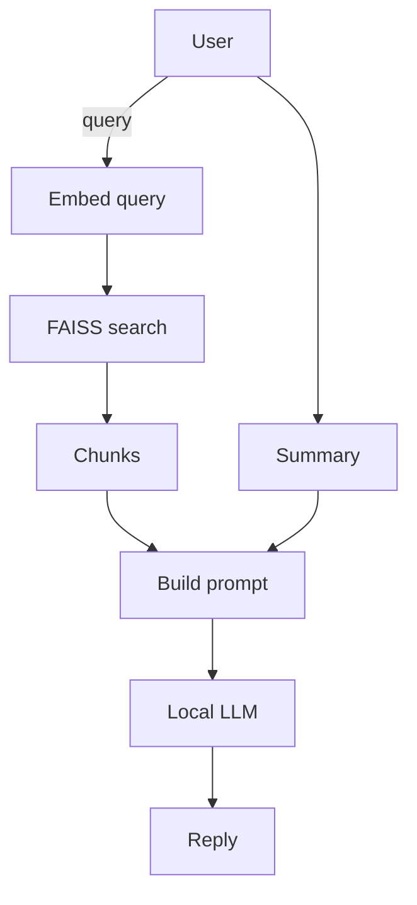

# Edge Code Assistant Copilot

A concise guide to stand-up an offline, high-accuracy coding assistant that runs entirely on a Jetson-class edge GPU (or any small CUDA device).  This document distills our chat on 12 Jun 2025 and keeps the "edge" discussion in one place.

---
## Quick-Context Summary (why this folder exists)
* We discussed disaster-recovery: how to rebuild a local AI copilot if the cloud agent is down.
* Goal: lightweight, privacy-preserving LLM with strong code abilities, minimal degradation on long sessions.
* Target HW: NVIDIA Jetson / other small GPUs.
* Outcome: step-by-step roadmap (model choices, runtimes, RAG, KV-cache hygiene, Jetson deployment).

Refer back to this README anytime to reload the big picture without scraping chat logs.

---
## 1  Choose a Foundation Model
| Type | Model | Params | Notes |
|------|-------|--------|-------|
| General | **Phi-3-mini** | 3.8 B | MIT license, great reasoning |
| General | **Llama-3-8B-Instruct** | 8 B | balanced NL + code |
| Code | **DeepSeek-Coder-6.7B** | 6.7 B | solid code scoring |
| Code | **Mistral-7B-Instruct** | 7 B | good all-round |

All fit into ~4 GB VRAM when quantised to 4-bit GGUF.

---
## 2  Edge-Friendly Runtimes
1. **llama.cpp / koboldcpp** – tiny C++ binary, GGUF q4_K_M, CUDA or CPU.
2. **TensorRT-LLM** – fastest on Jetson (paged KV, flash-attn).
3. **vLLM / exllamav2** – batching, OpenAI-compatible API.
4. **Ollama** – one-command server & model manager.

---
## 3  Prevent Context Degradation
* Sliding-window summariser → prepend compressed memory every ~N turns.
* Retrieval-Augmented Generation for code (tree-sitter chunks + FAISS/Qdrant).
* Hard reset when prompt ≈ 70 % of window, keep summaries + vector store.

---
## 4  Skeleton Architecture


---
## 5  Optional Fine-Tuning (LoRA)
* Gather ~1-2 k prompt/answer pairs from your repos.
* QLoRA on 8 B base; fits < 10 GB RAM.

---
## 6  Evaluation Harness
```bash
pip install lm-eval-harness
python -m lm_eval --model llama.cpp --tasks humaneval
```
Measure pass@1 + latency.

---
## 7  Jetson Deployment Checklist
1. Flash **JetPack ≥ 6.0** (CUDA 12, cuDNN 8, TensorRT 8.6).
2. Build llama.cpp with CUDA:
```bash
cmake -B build -DLLAMA_CUDA=ON -DCMAKE_BUILD_TYPE=Release .
cmake --build build -j$(nproc)
```
3. Run:
```bash
./build/bin/llama-server -m models/llama3-8b-instruct-q4_K_M.gguf -c 4096 -ngl 35
```

---
## 8  Turn-key Quick-Start
```bash
curl https://ollama.ai/install.sh | sh         # install server
ollama pull deepseek-coder:6.7b-q4_K_M        # download model
ollama serve &                                # start API on :11434
```
Point your IDE extension to `http://localhost:11434` (OpenAI chat completion endpoint).

---
## 9  Edge-Specific Tasks Log
| Date | Task |
|------|------|
| 2025-06-12 | Drafted complete roadmap for local coding assistant on Jetson |
| 2025-06-12 | Created this README to centralise "edge" guidance |

Add future "edge" tasks here so we can track them at a glance.

---
*Document generated by Cascade AI assistant.*
